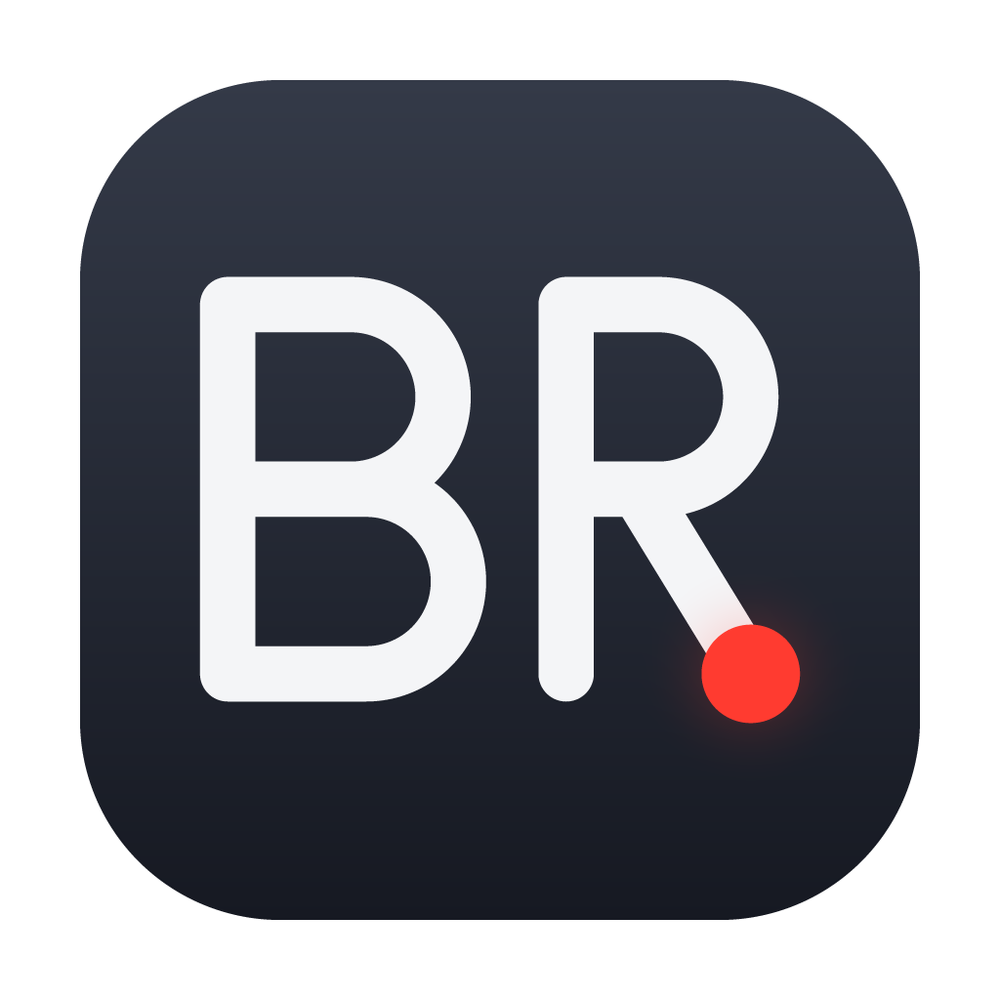
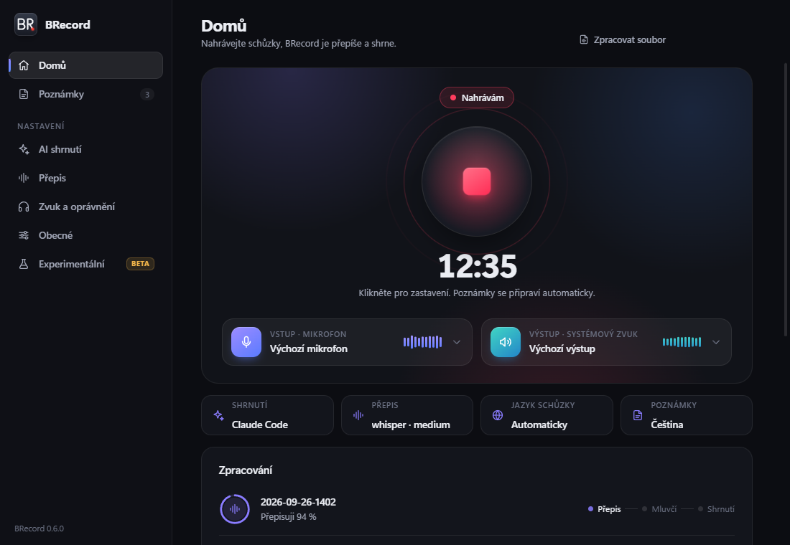

<div align="center">



# BRecord

**Zápisy ze schůzek, které zůstávají ve vašem počítači.**

[](https://github.com/myspulin24/brecord/releases/latest)
[](https://github.com/myspulin24/brecord/actions/workflows/ci.yml)
[](LICENSE)
[](https://github.com/myspulin24/brecord/releases/latest)

[Stažení](#stažení) · [Funkce](#funkce) · [Oprávnění](#oprávnění) · [Soukromí](#soukromí) · [Vývoj](#vývoj)

</div>

<picture>
  <source media="(prefers-color-scheme: light)" srcset="docs/home-light.png">
  
</picture>

## Přehled

BRecord nahraje schůzku jedním kliknutím: váš mikrofon i hlas ostatních účastníků ze zvuku počítače. Přepis udělá lokálně [whisper.cpp](https://github.com/ggml-org/whisper.cpp) a podle hlasu rozliší, kdo mluví. Shrnutí, rozhodnutí a úkoly s vlastníky sepíše Claude Code nebo Codex, do kterých už jste přihlášeni. Výsledek je obyčejný Markdown ve složce `~/MeetingNotes` a vedle něj zvuková nahrávka.

| | |
| --- | --- |
| **Platformy** | Windows 10/11, macOS 13+, Linux x64 |
| **Přepis** | whisper.cpp, lokálně (výchozí model medium) |
| **Shrnutí** | Claude Code CLI, Codex CLI, nebo Ollama offline |
| **Výstup** | Markdown + WAV |
| **Jazyk rozhraní** | čeština |
| **Licence** | MIT |

## Stažení

Instalátor pro svůj systém najdete na [stránce vydání](https://github.com/myspulin24/brecord/releases/latest).

| Systém | Soubor | Aktualizace |
| --- | --- | --- |
| Windows | `BRecord-Setup-<verze>.exe` | automaticky na pozadí |
| macOS (Apple Silicon) | `BRecord-<verze>-mac-arm64.dmg` | upozornění s odkazem |
| macOS (Intel) | `BRecord-<verze>-mac-x64.dmg` | upozornění s odkazem |
| Linux | `BRecord-<verze>-linux-*.AppImage` | automaticky na pozadí |
| Linux | `BRecord-<verze>-linux-*.deb` | správcem balíčků |

Instalátory nejsou podepsané komerčním certifikátem. Na Windows proto SmartScreen může ukázat „Neznámý vydavatel“ (*Další informace → Přesto spustit*). Na macOS aplikaci poprvé otevřete v *Nastavení systému → Soukromí a zabezpečení → Přesto otevřít*. Ke každému vydání patří `SHA256SUMS.txt`.

## Funkce

- **Nahrávání mikrofonu i zvuku počítače** do jedné stopy.
- **Rozlišení mluvčích podle hlasu** přímo v počítači. Mluvčí pojmenujete v poznámce a BRecord si hlasy zapamatuje, takže je příště pozná sám.
- **Výběr vstupu a výstupu** přímo na domovské obrazovce. U Teams a Zoomu zvolte komunikační zařízení.
- **Lokální přepis** přes whisper.cpp s volbou modelu a jazyka. **Slovník** jmen a pojmů platí pro přepis i shrnutí a opraví i to, co přepis plete (`SyteLine = Sideline`).
- **Shrnutí v pěti bodech, rozhodnutí a úkoly s vlastníky**, bez API klíčů přes přihlášení v CLI.
- **Přehled poznámek**, opakované shrnutí a zpracování libovolného zvukového souboru.
- **Úkoly k odškrtání:** u každé poznámky je označíte jako hotové, přidáte nebo upravíte. Změny se zapisují rovnou do Markdownu jako `- [x]`.
- **K vyřešení:** u poznámky, které se nepovedl přepis nebo shrnutí, vidíte důvod a opravíte ji jedním tlačítkem.
- **Otevírání v [Pilcrow](https://github.com/myspulin24/pilcrow)**, pokud ho máte nainstalovaný, jinak ve výchozí aplikaci pro `.md`.
- **Pojistky:** zvuk se zapisuje průběžně, po pádu se nahrávka obnoví a přepis se uloží dřív, než se žádá o shrnutí.

### Co je potřeba

- **whisper.cpp a model** nainstaluje aplikace sama (*Nastavení → Přepis*), na macOS přes [Homebrew](https://brew.sh).
- **Pro shrnutí** jedno z CLI, přihlášení pak proběhne přímo v *Nastavení → AI shrnutí*:

  ```bash
  npm install -g @anthropic-ai/claude-code   # Claude Code
  npm install -g @openai/codex               # Codex
  ```

## Oprávnění

| Systém | Co povolit |
| --- | --- |
| Windows | Mikrofon: *Nastavení → Soukromí a zabezpečení → Mikrofon → Povolit desktopovým aplikacím přístup*. Zvuk počítače nepotřebuje nic. |
| macOS | *Mikrofon* a *Nahrávání obrazovky a systémového zvuku*. Po povolení BRecord restartujte. |
| Linux | Zvuk počítače se nahrává z monitoru výchozího výstupu PulseAudio nebo PipeWire. |

## Soukromí

Bez účtů, bez cloudového úložiště, bez telemetrie. Zvuk i poznámky zůstávají ve vaší složce. Hlasové otisky zapamatovaných mluvčích jsou jen v `~/.brecord/voices.json` a v *Nastavení → Přepis* je jde zapomenout. Ven odchází jen text přepisu k poskytovateli shrnutí, kterého zvolíte (s Ollamou nikam), a kontrola aktualizací na GitHubu. Tu lze vypnout v *Nastavení → Obecné* nebo proměnnou `BRECORD_AUTO_UPDATE=0`. Při spouštění Claude Code a Codexu BRecord vypíná jejich historii relací i telemetrii.

## Vývoj

Potřebujete Node.js 20+.

```bash
npm ci
npm run setup      # whisper.cpp + model medium do ~/.brecord
npm start
```

| Příkaz | Co dělá |
| --- | --- |
| `npm test` | unit testy |
| `npm run lint` | ESLint |
| `npm run e2e` | přepis syntetické řeči přes whisper.cpp (potřebuje `espeak-ng`) |
| `npm run pack && npm run smoke` | sestavení a průchod všemi obrazovkami mimo displej |
| `npm run smoke:speakers` | rozpoznání mluvčích v sestavené aplikaci (po `pack`) |
| `npm run dist:win` · `dist:mac` · `dist:linux` | instalátory |

CI spouští lint, testy na Windows, macOS i Linuxu, end-to-end přepis, sestavení a smoke test aplikace a analýzu CodeQL.

**Vydání:** sekce `## X.Y.Z — datum` v [CHANGELOG.md](CHANGELOG.md) a stejná verze v `package.json` → push na `main` → zelené `ci` → `git tag vX.Y.Z && git push origin vX.Y.Z`. Workflow `release` sestaví všechny tři systémy, přiloží kontrolní součty a vydání zveřejní. Aplikace si ho pak najde sama.

## Licence

[MIT](LICENSE) © 2026 Michal Jašek

Rozpoznání mluvčích stojí na [sherpa-onnx](https://github.com/k2-fsa/sherpa-onnx) (Apache 2.0) s modely [pyannote segmentation 3.0](https://huggingface.co/pyannote/segmentation-3.0) (MIT) a [3D-Speaker CAM++](https://github.com/modelscope/3D-Speaker) (Apache 2.0). Modely se stahují při prvním použití a ověřují kontrolním součtem.
